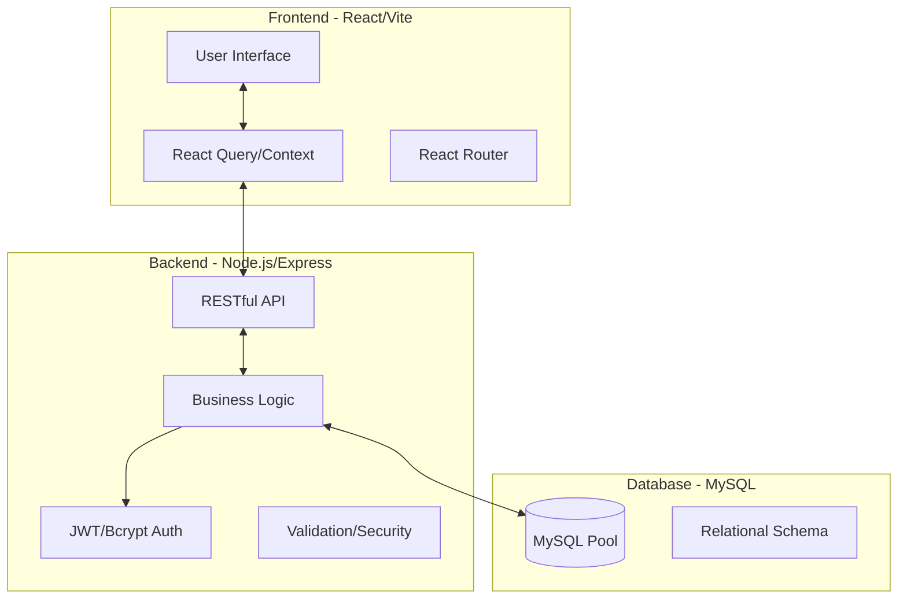
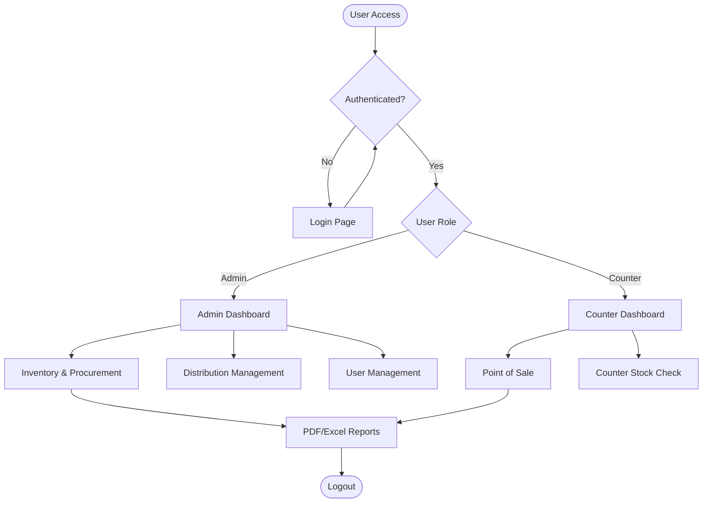
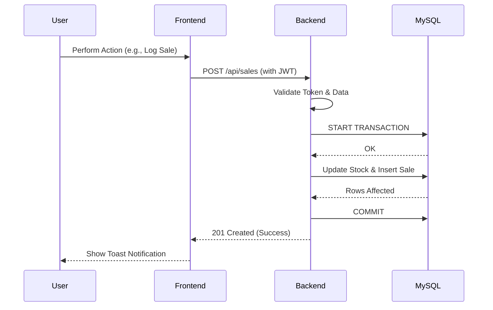
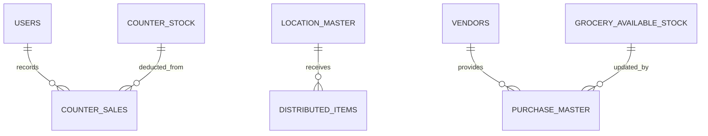
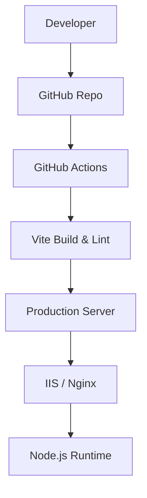

# 🚀 SmartNandha CMS: Production-Grade Canteen Management System

[](https://nodejs.org/)
[](https://reactjs.org/)
[](https://www.mysql.com/)
[](https://tailwindcss.com/)
[](https://vitejs.dev/)

A robust, full-stack **Canteen Management System** built with the PERN (PostgreSQL/MySQL, Express, React, Node) architecture. This system streamlines canteen operations, inventory tracking, vendor management, and real-time sales reporting with a focus on scalability and data integrity.

---

## 📖 Overview

### The Problem

Traditional canteen management relies on manual ledger entries, leading to:

- **Inventory Mismatch**: Inaccurate tracking of raw materials (groceries).
- **Opaque Distribution**: Difficulty tracking items sent to various counters.
- **Data Fragmentation**: Sales reports are hard to aggregate and analyze in real-time.

### The Solution

**SmartNandha CMS** provides a centralized platform that digitizes the entire lifecycle of a canteen:

- **Procurement**: Tracking vendor purchases and stock entry.
- **Production**: Managing prepared food items and their ingredients.
- **Distribution**: Seamless tracking of items moved from the main store to sub-counters.
- **Sales**: Real-time sales logging at the counter level with instant inventory deduction.

---

## 🧠 System Architecture

### 📊 Architecture Diagram



### 🏗️ Explanation

- **Data Flow**: Unidirectional state management on the frontend using TanStack Query for efficient server-state synchronization.
- **Client-Server Interaction**: Stateless RESTful communication secured by JWT tokens.
- **Scaling Approach**: The backend uses a MySQL connection pool to handle concurrent requests, while the frontend is optimized for fast TTI (Time to Interactive) via Vite's ESM-based build.

---

## 🔄 Application Flow

### 📌 Flowchart



### 🔁 Sequence Diagram



---

## 🧩 Module Breakdown

### 👑 Admin Module

- **Inventory Control**: Real-time tracking of raw groceries and prepared items.
- **Procurement**: Manage vendor details, purchase orders, and stock updates.
- **Distribution**: Centralized tracking of items distributed to various counters.
- **Reporting**: Advanced analytics for sales, purchases, and low-stock items.

### 🏪 Counter Module

- **Sales Interface**: Quick entry for food sales.
- **Local Stock**: Monitor available items at specific counter locations.
- **Dashboard**: Daily sales summary and performance metrics.

### 🔐 API & Security Layer

- **RESTful Endpoints**: Modular routing for users, inventory, sales, and vendors.
- **Data Integrity**: MySQL transactions ensure that stock updates and sales entries are atomic.
- **Security**: JWT-based authentication and password hashing using Bcrypt.

---

## ✨ Features

- **Real-time Dashboards**: Interactive charts (Recharts) showing 6-month trends.
- **Low Stock Alerts**: Automated priority flagging for materials below minimum thresholds.
- **PDF Report Generation**: Professional PDF exports for sales and inventory using `jsPDF`.
- **Responsive UI**: Sleek, mobile-friendly interface built with Tailwind CSS and Radix UI.
- **Role-Based Access Control (RBAC)**: Distinct permissions for Admin, Faculty, and Counter Staff.

---

## 🧰 Tech Stack (Detailed)

| Technology          | Usage              | Rationale                                                       |
| :------------------ | :----------------- | :-------------------------------------------------------------- |
| **React (Vite)**    | Frontend Framework | High-performance UI rendering and developer experience.         |
| **Node.js/Express** | Backend Server     | Non-blocking I/O for handling high-concurrency canteen traffic. |
| **MySQL**           | Database           | ACID compliance for critical financial and stock data.          |
| **Tailwind CSS**    | Styling            | Utility-first approach for rapid and consistent design.         |
| **JWT**             | Authentication     | Stateless and secure user sessions.                             |
| **React Query**     | State Management   | Auto-caching and efficient background data fetching.            |

---

## 📂 Project Structure

```text
CMS/
├── client/                # Frontend Application (React + Vite)
│   ├── src/
│   │   ├── components/    # Reusable UI components (Shadcn style)
│   │   ├── pages/         # Page-level components (Admin, Counter, Home)
│   │   ├── hooks/         # Custom React hooks (Data fetching)
│   │   └── lib/           # Utility functions (API client)
│   └── public/            # Static assets
└── server/                # Backend API (Node.js + Express)
    ├── controller/        # Business logic for each resource
    ├── routes/            # API endpoint definitions
    ├── migrations/        # SQL schema updates
    ├── utils/             # Helper functions (JWT, hashing)
    └── server.js          # Application entry point
```

---

## ⚙️ Installation & Setup

### 🖥️ System Requirements

- **Node.js**: v18.x or higher
- **Database**: MySQL 8.0+
- **OS**: Windows / Linux / macOS

### 🔧 Step-by-Step Setup

1.  **Clone the Repository**

    ```bash
    git clone https://github.com/your-username/smartnandha-cms.git
    cd smartnandha-cms
    ```

2.  **Environment Configuration**
    - Create a `.env` file in the `server` directory:
      ```env
      PORT=3001
      DB_HOST=localhost
      DB_USER=root
      DB_PASSWORD=your_password
      DB_NAME=canteen_db
      JWT_SECRET=your_super_secret_key
      ```
    - Create a `.env` file in the `client` directory:
      ```env
      VITE_API_URL=http://localhost:3001/api
      ```

3.  **Database Setup**
    - Create a database named `canteen_db` in MySQL.
    - Import the schema from `/server/db_schema.sql` (if available) or initialization scripts.

4.  **Install Dependencies**

    ```bash
    # Root
    npm install

    # Client
    cd client && npm install

    # Server
    cd ../server && npm install
    ```

5.  **Run the Application**

    ```bash
    # Run Server (from /server)
    npm run dev

    # Run Client (from /client)
    npm run dev
    ```

---

## 🔐 Security & Restrictions

- **JWT Authentication**: Protects all sensitive API endpoints.
- **Bcrypt Hashing**: Passwords are never stored in plain text.
- **SQL Injection Protection**: All database queries use prepared statements via `mysql2/promise`.
- **CORS Configuration**: Restricts API access to authorized domains only.

---

## 🗄️ Database Design

### 📊 ER Diagram



---

## 🚀 DevOps & Deployment

### 🐳 Scaling Strategy

- **Containerization**: Easily packageable into Docker containers for consistent deployment.
- **IIS Integration**: Includes `web.config` for seamless deployment on Windows/IIS servers using `iisnode`.
- **CI/CD**: Ready for integration with GitHub Actions for automated testing and deployment.

### ⚙️ Deployment Diagram



---

## 🧹 Project Optimization सुझाव (Improvements)

During the architectural review, the following optimizations were identified to enhance maintainability and security:

### 1. 🛡️ Security Enhancements (CRITICAL)

- **Middleware Enforcement**: Currently, routes in `server.js` are mounted without global authentication.
  - **Action**: Implement an `authMiddleware.js` in the `middlewares` folder and apply it to all `/api` routes except `/login`.
- **Auto-Password Migration**: The system currently supports a mix of plain-text and hashed passwords for legacy reasons.
  - **Action**: Run a one-time migration script to hash all existing user passwords and enforce hashing on the `createUser` endpoint.

### 2. 🏗️ Structural Improvements

- **Service Layer Pattern**: The controllers currently contain direct SQL logic.
  - **Action**: Move SQL queries into a `services/` directory to separate data access from request handling.
- **Consolidated API Routing**: All routers are currently mounted on `/api` separately.
  - **Action**: Create a central `index.js` in `routes/` that combines all routers, then mount that single router in `server.js`.

### 3. 🧹 Cleanup & Pruning

- **Redundant Files**:
  - `server/routes/demo.js`: Contains placeholder code. **Remove.**
  - `server/web.config`: Only necessary if using IIS. If deploying to Linux, move to a `deployment/` folder.
- **Environment Management**:
  - Provide `.env.example` files to prevent accidental leakage of secrets.

---

## 🔮 Future Enhancements

- **AI Demand Prediction**: Analyze historical sales to predict stock requirements for the next week.
- **Automated Reordering**: Integration with vendor APIs for automatic restocking.
- **Mobile App**: A specialized Flutter/React Native app for counter staff.

---

_Created with ❤️ by Rajkumar Anbazhagan._
